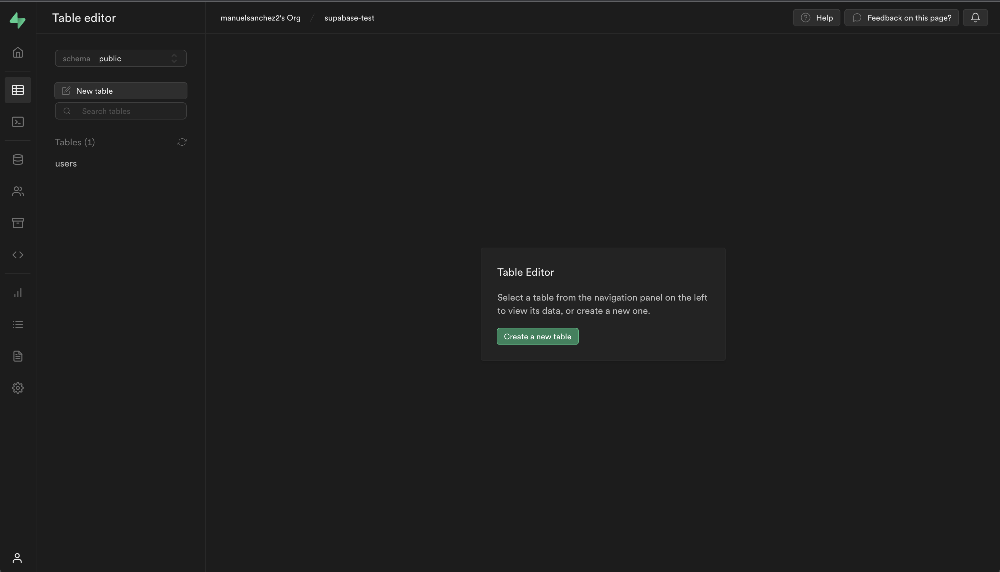
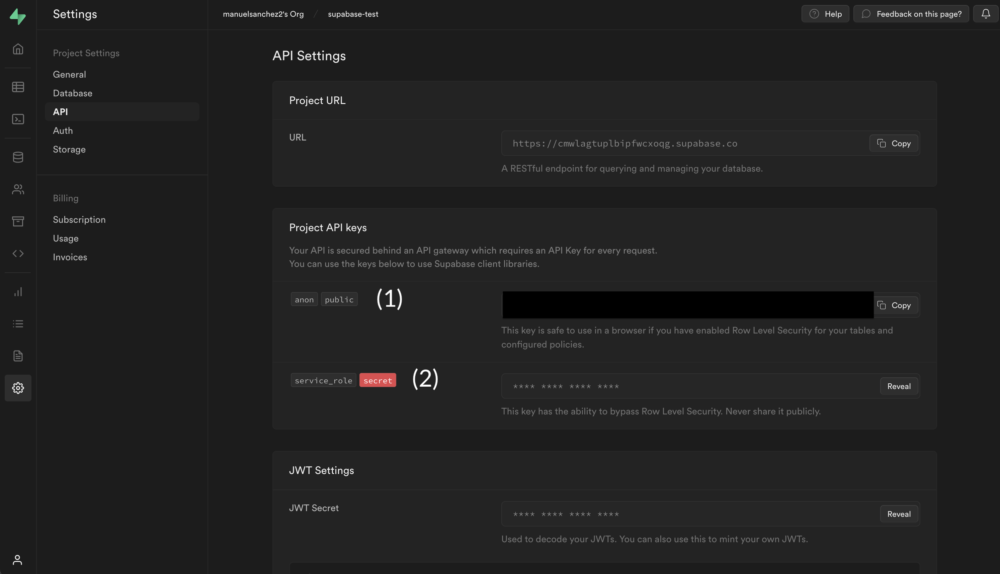
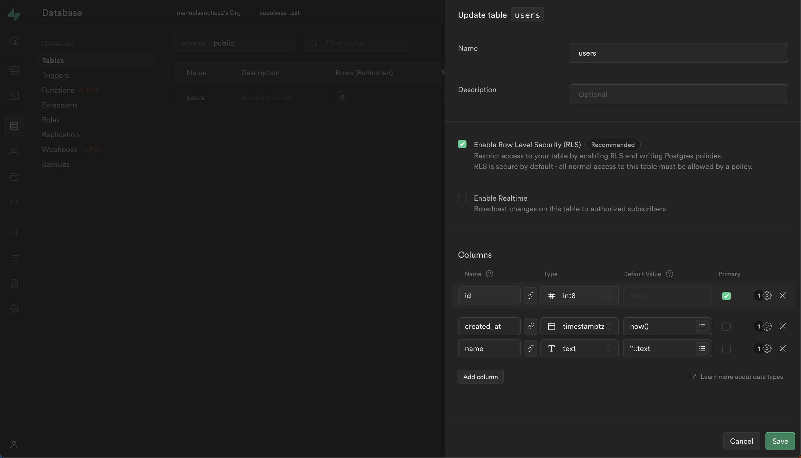

# Supabase - Uso con React en 5 sencillos pasos

## Live

[names-that-could-be-needed.netlify.app](names-that-could-be-needed.netlify.app)

## Licencia

[](https://choosealicense.com/licenses/mit/)

## Pasos a seguir

### 1. Accede a tu cuenta en Supabase

Crea tu cuenta en [supabase](https://linktodocumentation) si no la tienes todavía y crea una nueva tabla (en este caso la hemos llamado `users`) en la que vas a añadir la columna `name`. Dale de tipo `text`. Verás que por defecto están añadidas `id` y `created_at`.



### 2. Crea un proyecto con React e instala Supabase

```
npm create vite@latest supabase-test // elige React con TypeScript
npm install @supabase/supabase-js
```

### 3. Crea un .env en la raíz del proyecto y añade tu key de supabase



Aquí tenemos dos opciones, que te he dejado indicadas en la captura de imagen.

- Usar la key anon public (1), pero para ello tenemos que habilitar lo que nos dice de las RLS (Row Level Security). Para ello tenemos que ir a la pestaña de Database, luego a Tables y darle a editar. Ahí podemos desactivar la RLS.



- Usar la otra key (2), que es capaz de ignorar las barreras.

IMPORTANTE: Ambas opciones son solo para este entorno de práctica. No debemos hacer esto en producción bajo ningún concepto.

```
VITE_SUPABASE_KEY=COOL-KEY-DE-SUPABASE
```

### 4. Añade "strictNullChecks": false en tsconfig.json

```js
{
  "compilerOptions": {
    "target": "ESNext",
    "useDefineForClassFields": true,
    "lib": ["DOM", "DOM.Iterable", "ESNext"],
    "allowJs": false,
    "skipLibCheck": true,
    "esModuleInterop": false,
    "allowSyntheticDefaultImports": true,
    "strict": true,
    "forceConsistentCasingInFileNames": true,
    "module": "ESNext",
    "moduleResolution": "Node",
    "resolveJsonModule": true,
    "isolatedModules": true,
    "strictNullChecks": false,
    "noEmit": true,
    "jsx": "react-jsx"
  },
  "include": ["src"],
  "references": [{ "path": "./tsconfig.node.json" }]
}
```

### 5. Comprueba las funciones del CRUD en App.tsx

## Autores

- [@manuelsanchezweb](https://www.github.com/manuelsanchezweb)
